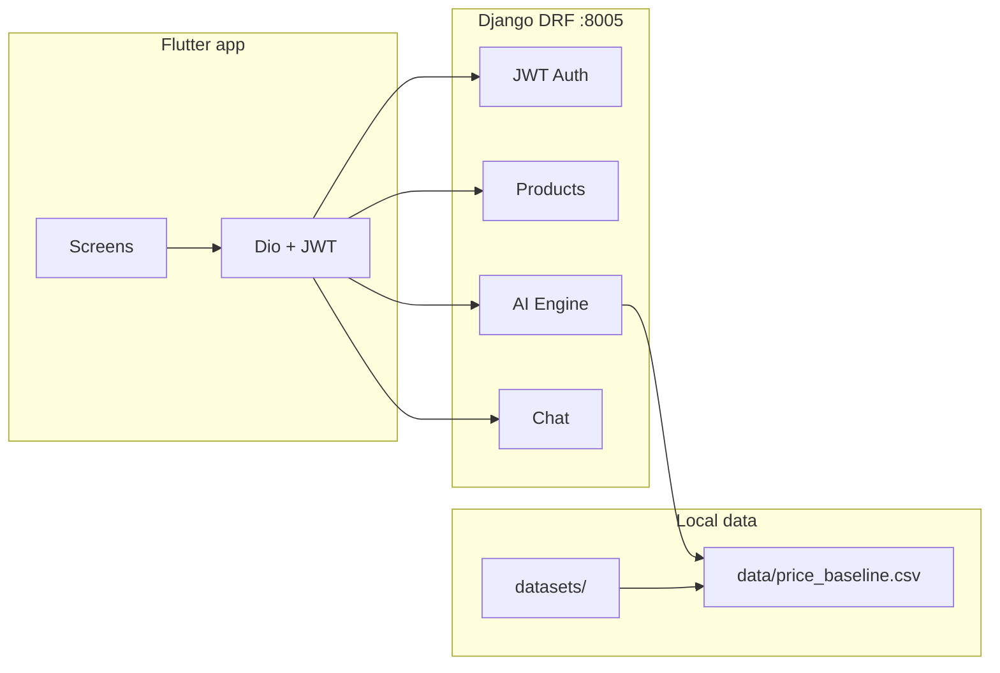

# ReCycle

ReCycle is an **AI-assisted marketplace** for used goods: a **Flutter** mobile client, an optional **Next.js** web storefront (`frontend_web/`), and a **Django REST Framework** backend with JWT auth, cloud vision LLMs (optional **OpenAI GPT-4o family** and/or **Google Gemini**) plus a local rule-based pricing fallback, dataset-driven price baselines, listings, and REST chat.

## Dissertation vs shipped build

| Report / thesis theme | This repository (v1) |
|----------------------|----------------------|
| Firebase / Firestore | **Scaffolded:** repo root `firebase.json`, `firestore.rules`, `functions/` (Callable OpenAI proxy). **Flutter** optional init + **`cached_ai_results`** writes after device-first analysis (`lib/core/firebase/`). **Primary** listings/auth remain **Django + SQLite** until you complete migration. |
| FastAPI microservice | **Optional** dev gateway in `gateway/` (OpenAI JSON proxy). Main API remains **Django + DRF**. |
| GPT-4o cloud reasoning | **Default model `gpt-4o`** when `OPENAI_MODEL` unset (`settings.py`). Device-first path: **`POST …/analyze-with-device-visual/`** (text-only to LLM; edge scores from Flutter). Legacy `analyze-with-ai` still runs server vision on the stored image. |
| On-device TFLite / MobileNet | **Online default path:** Flutter runs TFLite/heuristic **before** cloud; bundle `assets/models/condition_mobilenetv2_int8.tflite` for CNN. **Offline:** TFLite + local depreciation. |
| Evaluation metrics in prose | Tables 4–5 / SUS / MAE in the thesis are **your empirical results**; they are **not** hard-coded. Re-run benchmarks on devices/emulators after wiring TFLite. |

**Full chapter mapping (Hatim dissertation text):** `docs/HATIM_THESIS_VS_REPOSITORY.md`  
**Firebase migration (thesis Ch.3.6):** `docs/FIREBASE_MIGRATION.md`

## Architecture

- **Backend** (`backend/`): Django 5 + DRF + SimpleJWT + SQLite (dev) + drf-spectacular. Default dev URL **`http://127.0.0.1:8005`**. API base: **`/api/v1/`**. Media: `backend/media/products/`.
- **Frontend** (`frontend/`): Flutter (Riverpod + Dio + secure storage + image picker). **Thesis hybrid (default):** `HybridAiOrchestrator` resolves on-device **Eye** (TFLite asset or heuristic), then **`POST /seller/products/{id}/analyze-with-device-visual/`** so the cloud **Brain** (OpenAI/Gemini) receives **sanitized scores + metadata only** (no raw image bytes to the LLM). Offline/server-down falls back to TFLite + **local depreciation**. Optional **Firebase** bootstrap + **`cached_ai_results`** Firestore cache when `--dart-define` values are set (`docs/FIREBASE_MIGRATION.md`). Default API base **`http://10.0.2.2:8005/api/v1`** (Android emulator). Listing currency **`GBP`** (`ApiConfig.defaultCurrency`).
- **Web** (`frontend_web/`): Next.js 14+ app. If `NEXT_PUBLIC_API_URL` is unset, the browser calls same-origin **`/api/v1`** and **`/media`**, proxied to Django via `next.config.mjs` rewrites (`BACKEND_ORIGIN`, default `http://127.0.0.1:8005`). SSR uses **`INTERNAL_API_URL`** (see `frontend_web/.env.example`).
- **Datasets** (`datasets/` at repo root): scanned by `scripts/scan_datasets.py`; baselines built by `scripts/build_price_baseline.py`. Optional listings with real images: `python manage.py seed_listings_from_datasets --limit=40`.



## Backend setup (port 8005)

```powershell
cd backend
python -m venv venv
.\venv\Scripts\activate
pip install -r requirements.txt
copy .env.example .env
python manage.py makemigrations
python manage.py migrate
python manage.py createsuperuser
python scripts/seed_demo_data.py
python scripts/scan_datasets.py
python scripts/build_price_baseline.py
python manage.py seed_listings_from_datasets --limit=30
python manage.py runserver 8005
```

- **Swagger**: `http://localhost:8005/api/docs/` (schema: `/api/schema/`).
- **Smoke test** (with server running): `python scripts/test_api_flow.py`.

## Frontend setup

If `android/` / `ios/` folders are missing, generate platform projects once:

```powershell
cd frontend
flutter pub get
flutter create .
```

Then edit **`lib/core/config/api_config.dart`**:

- **Android emulator**: keep `androidEmulatorBaseUrl` (uses `10.0.2.2`).
- **iOS simulator / desktop / web**: use `localBaseUrl` (`localhost`).
- **Physical device**: set your PC LAN IP in `physicalDeviceBaseUrl` and use that as `baseUrl`.

Android **cleartext HTTP** may require `android:usesCleartextTraffic="true"` (or a Network Security Config) in `AndroidManifest.xml` for local HTTP.

```powershell
flutter run
```

## Dataset setup

Place datasets under **`datasets/`** (repo root). Optional env override: `DATASETS_DIR` in `backend/.env`.

After adding data, re-run:

```powershell
python scripts/scan_datasets.py
python scripts/build_price_baseline.py
```

Reports: `backend/docs/DATASETS_REPORT.md`, `backend/data/dataset_summary.json`, `backend/data/price_baseline.csv`.

## API URLs (local)

| Area        | URL |
|------------|-----|
| API base   | `http://localhost:8005/api/v1/` |
| OpenAPI UI | `http://localhost:8005/api/docs/` |
| Admin      | `http://localhost:8005/admin/` |

## Screenshots

_Add screenshots of the Flutter app and Swagger UI here for your report._

## Future improvements

- TensorFlow Lite / MobileNetV2 on-device image condition scoring (Flutter).
- Embedding index for “similar sold items” and richer comparables.
- WebSockets for live chat.
- Postgres + object storage for production deployment.

## License

Educational / final-year project use.
