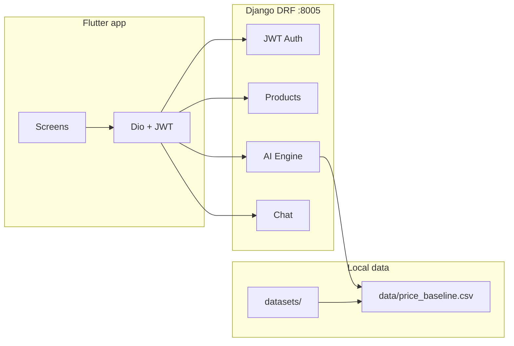

# ReCycle

ReCycle is an **AI-assisted marketplace** for used goods: a **Flutter** mobile client and a **Django REST Framework** backend with JWT auth, local rule-based “AI” pricing/condition scoring, dataset-driven price baselines, listings, and REST chat.

## Architecture

- **Backend** (`backend/`): Django 5 + DRF + SimpleJWT + SQLite (dev) + drf-spectacular. Runs on **`http://localhost:8005`**. API base: **`/api/v1/`**. Media: `backend/media/products/`.
- **Frontend** (`frontend/`): Flutter (Riverpod + Dio + secure storage + image picker). Default API base is **`http://10.0.2.2:8005/api/v1`** for the Android emulator (see `lib/core/config/api_config.dart`).
- **Datasets** (`datasets/` at repo root): scanned by `scripts/scan_datasets.py`; baselines built by `scripts/build_price_baseline.py`.



## Backend setup (port 8005)

```powershell
cd backend
python -m venv venv
.\venv\Scripts\activate
pip install -r requirements.txt
copy .env.example .env
python manage.py makemigrations
python manage.py migrate
python manage.py createsuperuser
python scripts/seed_demo_data.py
python scripts/scan_datasets.py
python scripts/build_price_baseline.py
python manage.py runserver 8005
```

- **Swagger**: `http://localhost:8005/api/docs/` (schema: `/api/schema/`).
- **Smoke test** (with server running): `python scripts/test_api_flow.py`.

## Frontend setup

If `android/` / `ios/` folders are missing, generate platform projects once:

```powershell
cd frontend
flutter pub get
flutter create .
```

Then edit **`lib/core/config/api_config.dart`**:

- **Android emulator**: keep `androidEmulatorBaseUrl` (uses `10.0.2.2`).
- **iOS simulator / desktop / web**: use `localBaseUrl` (`localhost`).
- **Physical device**: set your PC LAN IP in `physicalDeviceBaseUrl` and use that as `baseUrl`.

Android **cleartext HTTP** may require `android:usesCleartextTraffic="true"` (or a Network Security Config) in `AndroidManifest.xml` for local HTTP.

```powershell
flutter run
```

## Dataset setup

Place datasets under **`datasets/`** (repo root). Optional env override: `DATASETS_DIR` in `backend/.env`.

After adding data, re-run:

```powershell
python scripts/scan_datasets.py
python scripts/build_price_baseline.py
```

Reports: `backend/docs/DATASETS_REPORT.md`, `backend/data/dataset_summary.json`, `backend/data/price_baseline.csv`.

## API URLs (local)

| Area        | URL |
|------------|-----|
| API base   | `http://localhost:8005/api/v1/` |
| OpenAPI UI | `http://localhost:8005/api/docs/` |
| Admin      | `http://localhost:8005/admin/` |

## Screenshots

_Add screenshots of the Flutter app and Swagger UI here for your report._

## Future improvements

- TensorFlow Lite / MobileNetV2 on-device image condition scoring.
- CLIP / cloud vision (OpenAI, Gemini) behind feature flags.
- WebSockets for live chat.
- Postgres + object storage for production deployment.

## License

Educational / final-year project use.
